<div align="center">

# Arrow

<a href="https://git.io/typing-svg">
  
</a>

**Android Developer · Backend Builder · Smart Ecosystem**

专注于 Android 应用、后端服务与 Smart 生态产品建设。

</div>

<div align="center">
  
  
  
  
</div>

<br />

## About Me

- 构建面向手表与手机端的 Android 应用体验
- Smart应用商店作者
- Smart Music Next作者
- 维护认证、支付、积分、免签与音乐服务相关后端能力
- 关注真实业务数据、稳定交付、自动化与工程质量
- 持续打磨 Smart 生态产品矩阵

## Tech Focus

| Area | Focus |
| --- | --- |
| Android | Mobile apps, wearable apps, Android Studio ecosystem |
| Backend | API services, auth, payment, automation, integrations |
| Data | MySQL, production data workflows, service reliability |
| Delivery | GitHub Actions, repeatable builds, stable profile assets |

## GitHub Stats

<p align="center">
  <a href="https://github.com/guowenye">
    
  </a>
  <a href="https://github.com/guowenye">
    
  </a>
</p>

<p align="center">
  <picture>
    <source media="(prefers-color-scheme: onedark)" srcset="https://raw.githubusercontent.com/guowenye/guowenye/output/github-contribution-grid-snake-dark.svg">
    <source media="(prefers-color-scheme: light)" srcset="https://raw.githubusercontent.com/guowenye/guowenye/output/github-contribution-grid-snake.svg">
    
  </picture>
</p>


## Current Direction

```text
Android apps      -> watch and mobile product experiences
Backend services  -> auth, payment, points, VMQ and API integrations
Smart ecosystem   -> reusable product infrastructure and automation
Engineering       -> reliability, maintainability and production readiness
```

<div align="center">

**Building practical products, stable services, and better developer workflows.**

</div>
